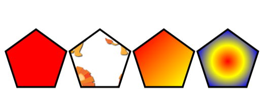

# React Konva

React Konva is a JavaScript library for drawing complex canvas graphics using [React](https://reactjs.org/)

# picture Demo

**How To use fill property in react-Konva ?**

**react-Konva  supports colors, patterns, linear gradients, and radial gradients.**

[Documentation](https://konvajs.org/docs/styling/Fill.html)
